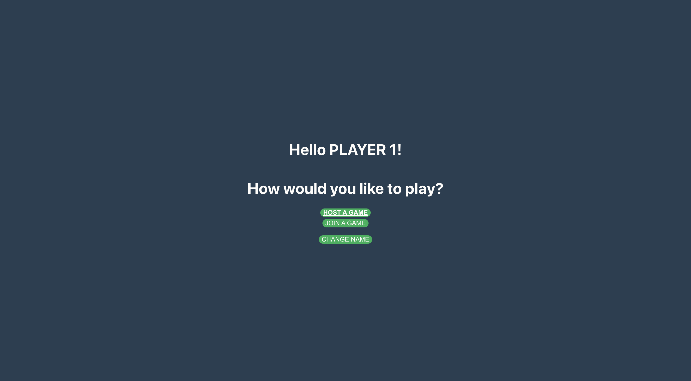
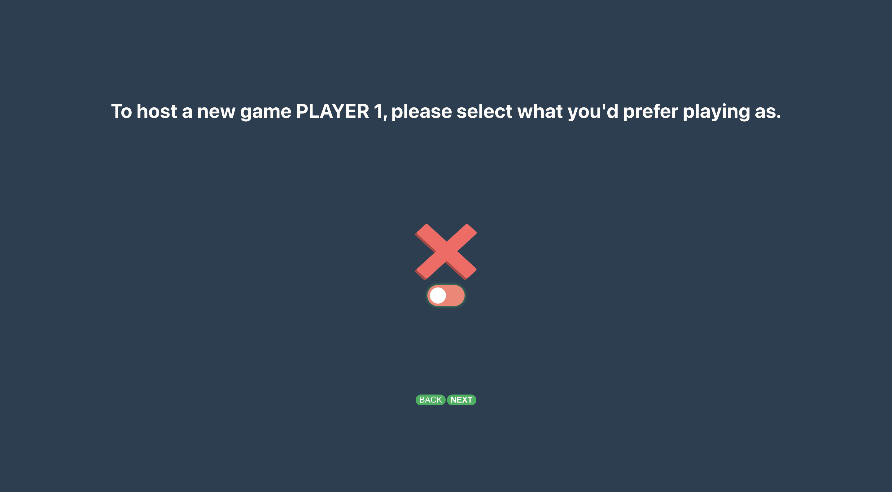
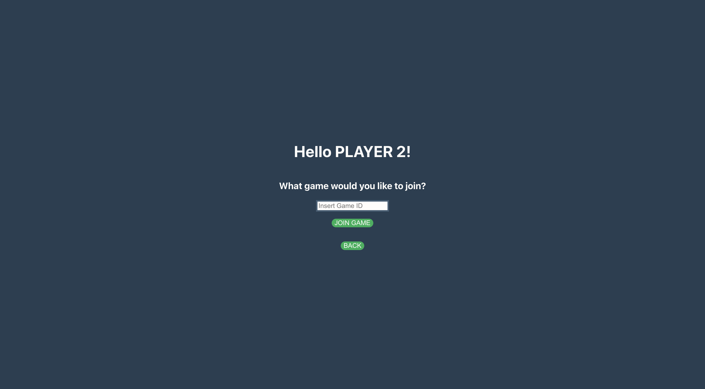

# Tic-Tac-Toe
This is a server for my Tic-Tac-Toe client, made in NodeJS.

# Features
- Two-player mode
- Real-time gameplay using websockets

# Installation
- Clone the repository
- Install dependencies for the server
- Start the server

# Usage
Once the server is running, simply run the client (with the usage information in the README.md) in your browser to start playing the game.

# Screenshots
Home screen:

Hosting a game:

Joining a game:

Playing a game:

